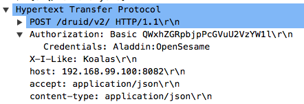

## Overview

It is easy to start using Turnilo with Druid by pointing it at your Druid cluster: `turnilo connect-druid broker_host:broker_port`
Turnilo will automatically introspect your Druid cluster and figure out available datasets.

Turnilo can be configured with a *config* YAML file. While you could write one from scratch it is recommended to let
Turnilo give you a head start by using it to generate a config file for you using the default introspection.

Run:

```bash
turnilo introspect-druid broker_host:broker_port --verbose > config.yaml
```

This will cause Turnilo to go through its normal startup and introspection routine and then dump the internally generated
config (complete with comments) into the provided file.

You can now run `turnilo run-config config.yaml` to run Turnilo with your config.

The next step is to open the generated config file in your favourite text editor and configure Turnilo to your liking.
Below we will go through a typical configuration flow. At any point you can save the config and re-launch Turnilo to load
that config in.


## Configuring the Turnilo server

**port** (number), default: 9090

The port that Turnilo should run on.

**verbose** (boolean), default: false

Indicates that Turnilo should run in verbose mode. This will log all the queries done by Turnilo.

**loggerFormat** *EXPERIMENTAL* (`plain` or `json`), default: `plain` 

Format for logged message. 
* `plain`: messages are logged as is.
* `json`: messages are wrapped in object with additional metadata and logged as stringified JSON.

Additional metadata for `json` format:
* `@timestamp`: ISO 8601 timestamp of logged event
* `level`: "INFO", "WARN", or "ERROR" string
* `logger`: name of the logger

**serverHost** (string), default: bind to all hosts

The host that Turnilo will bind to.

**serverRoot** (string), default: ""

A custom path to act as the server string.

The Turnilo UI will be served from `http://turnilo-host:$port/$serverRoot`

**serverTimeout** (number), default: 0

Timeout on all server request handlers in ms. Default value is 0 which means no timeout. 
Turnilo sets timeout on Response object for every incoming request. If response is not send before timeout, Turnilo closes connection.

**clientTimeout** (number), default: 0

Timeout on client requests in ms. Default value is 0 which means no timeout. 
Timeout is set in browser on every request to Turnilo server.

**readinessEndpoint** (string), default "/health/ready"

Readiness endpoint location. Checks readiness of druid clusters. See [Checking health of Turnilo instance](health-checking.md)

**livenessEndpoint** (string), default "/health/alive"

Liveness endpoint location. Reports liveness status of turnilo app.

**healthEndpoint** (string), deprecated

Old value that will be used as readinessEndpoint.

**iframe** ("allow" \| "deny"), default "allow"

Specify whether Turnilo will be allowed to run in an iFrame.
If set to "deny" Turnilo will set the following headers:

```
X-Frame-Options: "DENY"
Content-Security-Policy: "frame-ancestors 'none'"
```

This is used to prevent [Clickjacking](http://en.wikipedia.org/wiki/clickjacking).
Learn more about it on [MDN](https://developer.mozilla.org/en-US/docs/Web/HTTP/Headers/X-Frame-Options).

**trustProxy** ("none" \| "always"), default "none"

Should the server trust the `X-Forwarded-*` headers.  If "always", Turnilo will use the left-most entry from the header.

**strictTransportSecurity** ("none" \| "always"), default "none"

Specify that Turnilo should set the [StrictTransportSecurity](https://developer.mozilla.org/en-US/docs/Web/Security/HTTP_strict_transport_security) header.

Note that Turnilo can itself only run a http server.
This option is intended to be used when Turnilo is running behind an HTTPS terminator like AWS ELB.


## Configuring the Clusters

The top level `clusters:` key that holds the clusters that Turnilo will connect to.


### General properties

Each cluster has the following properties:

**name** (string)

The name of the cluster (to be referenced later from the data cube).

**type** ('druid')

The database type of the cluster. Currently only Druid is supported.

**url** (string)

The url address (http[s]://hostname[:port]) of the cluster. If no port, 80 is assumed for plain http, and 443 for secure https.

**host** deprecated (string)

The host (hostname:port) of the cluster, http protocol is assumed. Deprecated, use **url** field

**auth**

The cluster authorization strategy.

* Http Basic authorization

Strategy will add `Authorization` header to each request to cluster and encode passed username and password with base64.

```yaml
auth:
  type: "http-basic"
  username: Aladdin
  password: OpenSesame
```

This would result in all Druid request having added headers



**version** (string)

The explicit version to use for this cluster.
Define this to override the automatic version detection.

**timeout** (number)

The timeout to set on the Druid queries in ms. See [documentation](https://druid.apache.org/docs/latest/querying/query-context.html)

**retry** (object)

Options for retries on Druid native queries. If no object is provided Turnilo will not retry failed queries.
Object should have the following structure:

```yaml
retry:
    maxAttempts: 10
    delay: 1000
``` 

* `maxAttempts` is count of maximum attempts for retry. Default values is 5
* `delay` is time in ms between each attempt.

**healthCheckTimeout** (number), default: 1000

The timeout for the cluster health checking request in ms. See [Checking health of Turnilo instance](health-checking.md)

**sourceListScan** ("auto" \| "disable"), default: "auto"

Should the sources of this cluster be automatically scanned and new sources added as data cubes.

**sourceListRefreshOnLoad** (boolean), default: false

Should the list of sources be reloaded every time that Turnilo is loaded.
This will put additional load on the data store but will ensure that sources are visible in the UI as soon as they are created.

**sourceListRefreshInterval** (number), minimum: 1000, default: 0

How often should sources be reloaded in ms. Default value of 0 disables periodical source refresh.

**sourceReintrospectOnLoad** (boolean), default: false

Should sources be scanned for additional dimensions every time that Turnilo is loaded.
This will put additional load on the data store but will ensure that dimension are visible in the UI as soon as they are created.

**sourceReintrospectInterval** (number), minimum: 1000, default: 0

How often should source schema be reloaded in ms. Default value of 0 disables periodical source refresh.

**sourceTimeBoundaryRefreshInterval** (number), minimum: 1000, default: 60000

How often should source max time be refreshed in ms. Turnilo sends [time boundary query](https://druid.apache.org/docs/latest/querying/timeboundaryquery.html) to Druid cluster to get source max time.
Smaller values will ensure that turnilo is aware of freshly added data but also would put load on the data store with additional queries.


### Druid specific properties

**introspectionStrategy** ("segment-metadata-fallback" \| "segment-metadata-only" \| "datasource-get"), default: "segment-metadata-fallback"

The introspection strategy for Druid cluster.

**requestDecorator** (string)

The request decorator module filepath to load.

**decoratorOptions** (any)

Options passed to the request decorator module
