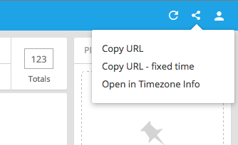

# Configuring Pivot

It is easy to start using Pivot with Druid by pointing it at your Druid cluster: `pivot --druid druid.broker.host:8082`
but to make the most of Pivot you will want to configure it.

Pivot can be configured with a *config* YAML file. While you could write one from scratch it is recommended to let
Pivot give you a head start by using it to generate a config file for you using the default introspection.

Run:

```bash
pivot --druid druid.broker.host:8082 --print-config --with-comments > config.yaml
```

This will cause Pivot to go through its normal startup and introspection routine and then dump the internally generated
config (complete with comments) into the provided file.

You can now run `pivot --config config.yaml` to run Pivot with your config.

The next step is to open the generated config file in your favourite text editor and configure Pivot to your liking.
Below we will go through a typical configuration flow. At any point you can save the config and re-launch Pivot to load
that config in.

## Configuring the Pivot server

**verbose** (boolean)

Indicates that Pivot should run in verbose mode. This will log all the queries done by Pivot.

**port** (number)

The port that Pivot should run on. Default 9090.

**serverHost** (string)

The host that Pivot will bind to. Defaults to all hosts.

**serverRoot** (string)

A custom path to act as the server string. Default: `pivot`

The Pivot UI will be served from `http://pivot-host:$port/` and `http://pivot-host:$port/$serverRoot`

**iframe** ("allow" | "deny")

Specify whether Pivot will be allowed to run in an iFrame.
If set to 'deny' Pivot will set the following headers:

```
X-Frame-Options: "DENY"
Content-Security-Policy: "frame-ancestors 'none'"
```

This is used to prevent [Clickjacking](http://en.wikipedia.org/wiki/clickjacking).
Learn more about it on [MDN](https://developer.mozilla.org/en-US/docs/Web/HTTP/Headers/X-Frame-Options).

**trustProxy** ("none" | "always")

Should the server trust the `X-Forwarded-*` headers.

**strictTransportSecurity** ("none" | "always")

Specify that Pivot should set the [StrictTransportSecurity](https://developer.mozilla.org/en-US/docs/Web/Security/HTTP_strict_transport_security) header.

Note that Pivot can itself only run an http server.
This option is intended to be used when when Pivot is running behind a HTTPS terminator like AWS ELB.

## Configuring the Clusters

The top level `clusters:` key that holds the clusters that Pivot will connect to.

### General properties

Each cluster has the following properties:

**name** (string)

The name of the cluster (to be referenced later from the data cube)

**type** ('druid' | 'mysql' | 'postgres')

The database type of the cluster

**host** (string)

The host (hostname:port) of the cluster. In the Druid case this must be the broker.

**version** (string)

The explicit version to use for this cluster.
Define this to override the automatic version detection.

**timeout** (number)

The timeout to set on the queries in ms. Default: 40000

**sourceListScan** ('disable' | 'auto')

Should the sources of this cluster be automatically scanned and new sources added as data cubes. Default: 'auto'

**sourceListRefreshOnLoad** (boolean)

Should the list of sources be reloaded every time that Pivot is loaded.
This will put additional load on the data store but will ensure that sources are visible in the UI as soon as they are created.

**sourceListRefreshInterval** (number)

How often should sources be reloaded in ms.

**sourceReintrospectOnLoad** (boolean)

Should sources be scanned for additional dimensions every time that Pivot is loaded.
This will put additional load on the data store but will ensure that dimension are visible in the UI as soon as they are created.

**sourceReintrospectInterval** (number)

How often should source schema be reloaded in ms.

### Druid specific

**introspectionStrategy** (string)

The introspection strategy for the Druid external.

**requestDecorator** (string)

The request decorator module filepath to load.

**decoratorOptions** (any)

Options passed to the request decorator module

### Postgres + MySQL specific

**database** (string)

The database to which to connect to.

**user** (string)

The user to connect as. This user needs no permissions other than SELECT.

**password** (string)

The password to use with the provided user.


## Configuring the DataSources

The top level `dataCubes:` key that holds the data cubes that will be loaded into Pivot.
The order of the data cubes in the config will define the ordering seen in the UI.


### Basic data cube properties

Described here are only the properties which you might want to change.

**name** (string)

The name of the data cube as used internally in Pivot and used in the URLs. This should be a URL safe string.
Changing this property for a given data cube will break any URLs that someone might have generated for that data
cube in the past.

**clusterName** (string)

The cluster that the data cube belongs to (or `'native'` if this is a file based data cube)

**title** (string)

The user visible name that will be used to describe this data cube in the UI. It is always safe to change this.

**description** (string)

The description of the data cube shown in the homepage.

**defaultTimezone** (string - timezone)

The default timezone, expressed as an [Olsen Timezone](https://en.wikipedia.org/wiki/Tz_database),
that will be selected when the user first opens this cube. Default `Etc/UTC`.

**defaultDuration** (string - duration)

The time period, expressed as an [ISO 8601 Duration](https://en.wikipedia.org/wiki/ISO_8601#Durations),
that will be shown when the user first opens this cube. Default `P1D` (1 day).

**defaultSortMeasure** (string)

The name of the measure that will be used for default sorting. It is commonly set to the measure that represents the
count of events. Default: the first measure.

**defaultSelectedMeasures** (string[])

The names of the measures that will be selected by default. Default: first four measures.

**defaultPinnedDimensions** (string[])

The names of the dimensions (in order) that will appear *pinned* by default on the right panel. Default: `[]`.


### Attribute Overrides

While Pivot tries to learn as much as it can from your data cube from Druid directly.
It can not (yet) do a perfect job. The `attributeOverrides:` section of the data cube is there for you to fix that.

**name** (string)

The name of the attribute (column) in Druid. This must match the Druid name.

Here are some common scenarios where you should add an attribute override:

#### You have a HyperLogLog metric column but Pivot is not detecting it

If you have a HyperLogLog metric (say: `unique_things`) it is possible that Druid introspection (Druid <= 0.8.3) will
not describe it correctly.
In that case it will be assumed to be a regular numeric column and will ether return incorrect results (or error out)
when included in queries.

You should add:

```yaml
         - name: unique_things
           special: unique
```

To the `attributeOverrides` to tell Pivot that this is indeed a special (hyperUnique) column.

You should also ensure that wherever it is used in the measures it is aggregated with `countDistinct($unique_things)`.

#### You have a numeric dimension

Pivot can not corretly detect numeric dimensions as Druid reports all dimensions to be strings.
When a numeric dimension is incorrectly classified as a string its soring will appear wrong in the UI.
If you have a dimension with numeric values (say: `age`).

You should add:

```yaml
         - name: age
           type: NUMBER
```

To the `attributeOverrides` to tell Pivot that this is numeric.

You can now use `$age` in numeric expressions. For example you could create a dimension with the formula
`$age / 2 + 7`.


### Dimensions

In this section you can define the dimensions that users can *split* and *filter* on in the UI.
The order of the dimension list in the top of the left panel is determined by the order of the dimensions definitions
in this section.

**name** (string)

The name of the dimension.
This does not have to correspond to the attribute name (but the auto generated dimensions do).
This should be a URL safe string.
Changing this property will break any URLs that someone might have generated that include this dimension.

**title** (string)

The title for this dimension in the UI. Can be anything and is safe to change at any time.

**url** (string)

A url associated with the dimension, with optional token '%s' that is replaced by the dimension value to generate
a link specific to each value.

**granularities** (string[5])

For time dimensions you can define a set of exactly 5 granularities that you want to be available for bucketing.

Each granularity must be expressed as a 'floorable' [ISO 8601 duration](https://en.wikipedia.org/wiki/ISO_8601#Durations)
A floorable duration is any duration that is either a single period like `P1D`, `P1W`, `PT1S`, e.t.c. or a multiple period
that divides into the larger period. For example, `P3M` is floorable because 3 divides 12 but `P5M` is not floorable.

By default `granularities` is set to: `['PT1M', 'PT5M', 'PT1H', 'P1D', 'P1W']`

If you mainly care about smaller intervals, you might want to set it to: `['PT1S', 'PT15S', 'PT30S', 'PT1M', 'PT1H']`

Alternatively, if you mainly care about large intervals, you might want to try: `['P1D', 'P1W', 'P1M', 'P3M', 'P1Y']`

**bucketingStrategy** ('defaultBucket' | 'defaultNoBucket')

Specify whether or not the dimension should be bucketed by default. If unspecified defaults to 'defaultBucket' for time and numeric dimensions.

**sortStrategy** ('self' | `someMeasureName`)

Specify a specific sort strategy for this dimension in visualizations. If unspecified defaults to best sort strategy based on the visualization.

**formula** (string - plywood expression)

The formula for this dimension. By default it is `$name` where *name* is the name of the dimension.
You can create derived dimensions by using non-trivial formulas.

Here are some common use cases for derived dimensions:

#### Lookups

If you have a dimension that represents an ID that is a key into some other table. You may have set up a
[Druid Query Time Lookup](http://druid.io/docs/latest/querying/lookups.html) in which case you could

```yaml
      - name: correctValue
        formula: $lookupKey.lookup('my_awesome_lookup')
```

Which would apply the lookup.

You can also apply the `.fallback()` action as ether:

- `$lookupKey.lookup('my_awesome_lookup').fallback($lookupKey)` to keep values that were not found as they are.
- `$lookupKey.lookup('my_awesome_lookup').fallback('missing')` to map missing values to the word 'missing'.

#### Extraction

Imagine you have an attribute `resourceName` which has values:

```json
["druid-0.8.2", "druid-0.8.1", "druid-0.7.0", "index.html"]
```

You could apply, for example, the `.extract` function by creating the following dimension:

```yaml
      - name: resourceVersion
        formula: $resourceName.extract('(\d+\.\d+\.\d+)')
```

Which would have values:

```json
["0.8.2", "0.8.1", "0.7.0", null]
```

#### Boolean

It is often useful to create dimensions that are the result of some boolean expression.
Let's say that you are responsible for all accounts in the United States as well as some specific account you could create a dimension like:

```yaml
      - name: myAccounts
        formula: $country == 'United States' or $accountName.in(['Toyota', 'Honda'])
```

Now my account would represent a custom filter boolean diemension.

#### Custom transformations

If no existing plywood function meets your needs, you could also define your own custom transformation.
The transformation could be any supported [Druid extraction function](http://druid.io/docs/latest/querying/dimensionspecs.html).

For example you could apply any number of javascript functions to a string.

To use that in Pivot define:

```yaml
    options:
      customTransforms:
        stringFun:
          extractionFn:
            type: javascript
            function: function(x) { return decodeURIComponent(x).trim().charCodeAt(0) }
```

Then in the dimensions simply reference `stringFun` like so:

```yaml
      - name: stringFun
        title: String Fun
        formula: $countryURL.customTransform('stringFun')
```

### Measures

In this section you can define the measures that users can *aggregate* on (*apply*) on in the UI.
The order of the measure list in the bottom of the left panel is determined by the order of the measure definitions
in this section.

**name** (string)

The name of the measure.
This should be a URL safe string.
Changing this property will break any URLs that someone might have generated that include this measure.

**title** (string)

The title for this measure in the UI. Can be anything and is safe to change at any time.

**units** (string)

The units for this measure. To be shown alongside the title.

**formula** (string - plywood expression)

The [Plywood expression](http://plywood.imply.io/expressions) for this dimension. By default it is `$main.sum($name)` where *name* is the name of the measure.

The `$main` part of the measure expressions serves as a placeholder for the data segment.
In Plywood every aggregate is a function that acts on a data segment.

You can create derived measures by using non-trivial expressions. Here are some common use cases for derived dimensions:


#### Dividing to compute ratios

Ratios are generally considered fun.

```yaml
      - name: ecpm
        title: eCPM
        formula: $main.sum($revenue) / $main.sum($impressions) * 1000
```


#### Filtered aggregations

A very powerful tool is to use a filtered aggregate.
If, for example, your revenue in the US is a very important measure you could express it as:

```yaml
      - name: usa_revenue
        title: USA Revenue
        formula: $main.filter($country == 'United States').sum($revenue)
```

It is also common to express a ratio of something filtered vs unfiltered.

```yaml
      - name: errorRate
        formula: $main.filter($statusCode == 500).sum($requests) / $main.sum($requests)
```


#### Custom aggregations

Within the measures you have access to the full power of the [Plywood expressions](http://plywood.imply.io/expressions).
If you ever find yourself needing to go beyond the expressive potential of Plywood you could define your own custom aggregation.
The aggregation could be any supported Druid aggregation.

For example Plywood currently does not support the modulo operator.
While Druid has no native modulo support ether it is possible to modulo a measure by using a [javascript aggregator](http://druid.io/docs/latest/querying/aggregations.html#javascript-aggregator).

To use that in Pivot define:

```yaml
    options:
      customAggregations:
        addedMod1337:
          aggregation:
            type: javascript
            fieldNames: ['added']
            fnAggregate: "function(current, added) { return (current + added) % 1337 }"
            fnCombine: "function(partialA, partialB) { return (partialA + partialB) % 1337 }"
            fnReset: "function() { return 0; }"
```

Then in the measures simply reference `addedMod1337` like so:

```yaml
      - name: addedMod
        title: Added Mod 1337
        formula: $main.customAggregate('addedMod1337')
```

This functionality can be used to access any custom aggregations that might be loaded via extensions.


#### Switching metric columns

If you switch how you ingest you underlying metric and can't (or do not want to) recalculate all of the previous data,
you could use a derived measure to seemly merge these two metrics in the UI.

Let's say you had a metric called `revenue_in_dollars` and for some reason you will now be ingesting it as `revenue_in_cents`.

Furthermore right now your users are using pivot with the measure:

```yaml
      - name: revenue
        title: Revenue
        formula: $main.sum($revenue_in_dollars)
```

If your data had a 'clean break' where all events have ether `revenue_in_dollars` or `revenue_in_cents` with no overlap you could use:

```yaml
      - name: revenue
        title: Revenue
        formula: $main.sum($revenue_in_dollars) + $main.sum($revenue_in_cents) / 100
```

If instead there was a period where you were ingesting both metrics then the above solution would double count that interval.
You can 'splice' these two metrics together at a specific time point.

Logically you should be able leverage the [Filtered aggregations](#filtered-aggregations) to do:

```yaml
      - name: revenue  # DO NOT DO THIS IT WILL NOT WORK WITH DRUID < 0.9.2
        title: Revenue
        formula: >
          $main.filter(__time < '2016-04-04T00:00:00Z').sum($revenue_in_dollars) +
          $main.filter('2016-04-04T00:00:00Z' <= __time).sum($revenue_in_cents) / 100
```

But the above will not work because, as of this writing, [Druid can not filter on time in measures](https://github.com/druid-io/druid/issues/2816).

Instead you can leverage [Custom aggregations](#custom-aggregations) and the `javascript` aggregation to achieve essentially the same thing:

```yaml
    # Add this to the data cube options
    options:
      customAggregations:
        revenueSplice:
          aggregation:
            type: javascript
            fieldNames: ['__time', 'revenue_in_dollars', 'revenue_in_cents']
            fnAggregate: "function(current, time, revD, revC) { return current + (time < 1442080800000 ? revD : (revC / 100)); }"
            fnCombine: "function(partialA, partialB) { return partialA + partialB; }"
            fnReset: "function() { return 0; }"
```

Then in the measure definitions:

```yaml
      - name: revenue
        title: Revenue
        formula: $main.custom('revenueSplice')
```

Note that whichever method you chose you should not change the `name` attribute of your original measure as it will preserve the function of any bookmarks.

## Customization

You can define a `customization` option in the config to configure some aspects of the look and feel of Pivot.

### Visual

Can customize the header background color and logo icon by supplying a color string and SVG string respectively.

```yaml
  customization:
    customLogoSvg: >
      <svg width="300" height="200"
        xmlns="http://www.w3.org/2000/svg"
        xmlns:xlink="http://www.w3.org/1999/xlink">
        <rect width="100%" height="100%" fill="green" />
      </svg>

    headerBackground: '#2D95CA'
```

### External links

Pivot supports defining external view links with access to `dataCube`, `filter`, `splits`, and `timezone` objects at link generation time.
This is done by defining a function body in the configuration file.

For example:

```yaml
  customization:
    externalViews:
      - title: Timezone Info
        linkGenerator: >
          {
            return 'http://www.tickcounter.com/timezone/' + timezone.toString().toLowerCase().replace(/\//g, '-');
          }
```

These custom links will appear in the share menu.



By default, external views are opened in a new tab but you can disable this by setting `sameWindow: true`

### Timezones

You can customize the timezones that appear in the header bar dropdown by providing an array of timezone strings.

For example:

```yaml
  customization:
    timezones: ['Pacific/Niue', 'Pacific/Marquesas', 'America/Tijuana']
```

These timezones will appear in the dropdown instead of the default, which are

`['America/Juneau', 'America/Los_Angeles', 'America/Yellowknife', 'America/Phoenix', 'America/Denver', 'America/Mexico_City', 'America/Chicago', 'America/New_York', 'America/Argentina/Buenos_Aires', 'Etc/UTC',
'Asia/Jerusalem', 'Europe/Paris', 'Asia/Kathmandu', 'Asia/Hong_Kong', 'Asia/Seoul', 'Pacific/Guam']`
